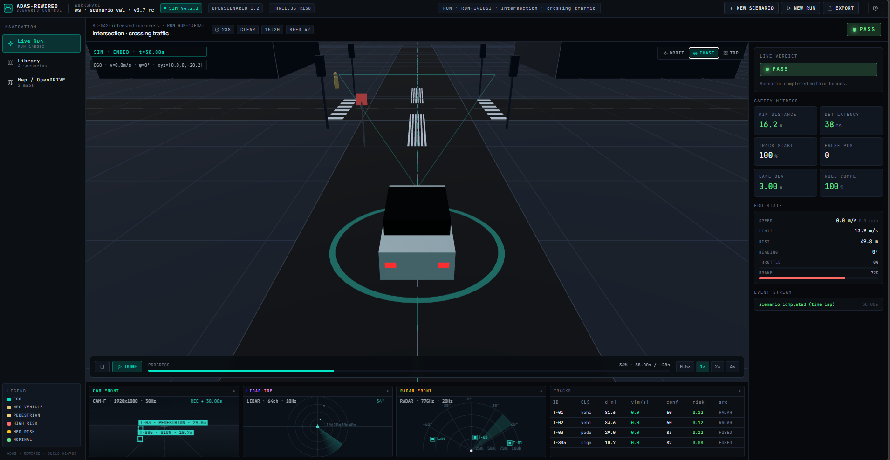
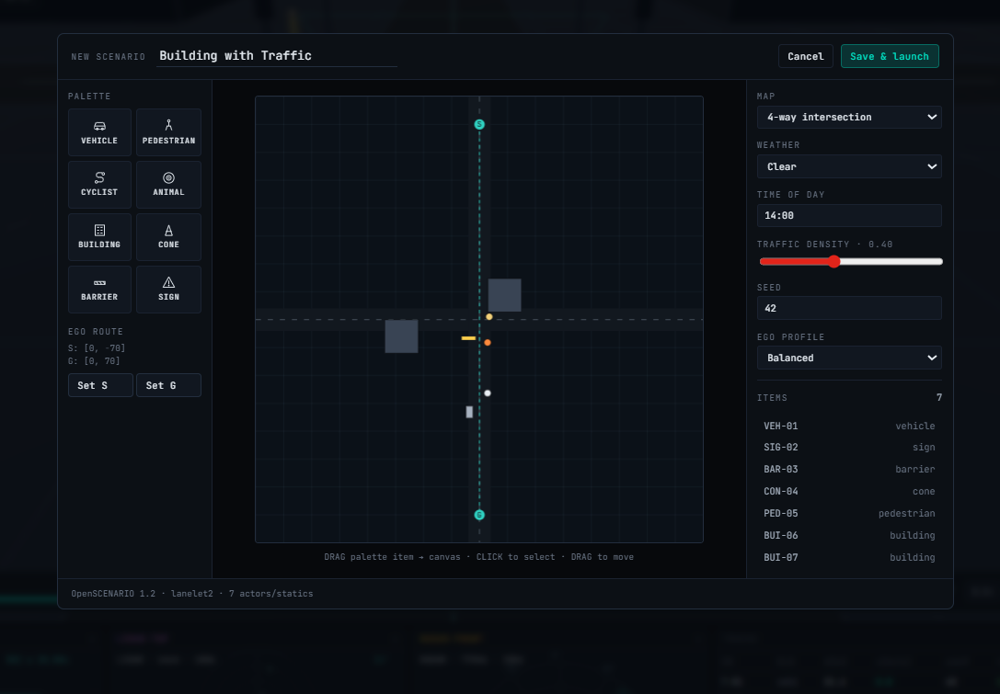

# ADAS Rewired · Scenario Control

A browser-based ADAS (Advanced Driver Assistance Systems) scenario simulator rendered as a dark "cockpit" UI. Loads seeded scenarios (intersection with crossing traffic, pedestrian crossing, construction zone, unavoidable diversion), animates scripted-waypoint traffic in a real Three.js viewport, scores each run against a live safety envelope (collision → FAIL, completion → PASS), and plays a synthesized automotive soundscape while you drive.

> **Live demo:** https://isaac-rnd.github.io/ADAS-scenario-generator/





---

## Table of contents

- [At a glance](#at-a-glance)
- [Architecture](#architecture)
- [Core concepts](#core-concepts)
- [End-to-end flow](#end-to-end-flow)
- [Data models](#data-models)
- [Scenario authoring](#scenario-authoring)
- [Simulation engine](#simulation-engine)
- [Perception pipeline](#perception-pipeline)
- [Audio system](#audio-system)
- [Running locally](#running-locally)
- [Deployment](#deployment)
- [Configuration](#configuration)
- [Extension points](#extension-points)
- [Keyboard & interaction reference](#keyboard--interaction-reference)
- [Troubleshooting](#troubleshooting)
- [Performance notes](#performance-notes)

---

## At a glance

| Area                | What you get                                                                                            |
| ------------------- | ------------------------------------------------------------------------------------------------------- |
| **3D viewport**     | Real Three.js scene: roads, crosswalks, traffic lights, buildings, ego vehicle with brake-light emissives and a halo ring; orbit / chase / top-down cameras. |
| **Simulation**      | 30 Hz scripted-waypoint loop for ego + NPCs with heading lerp, acceleration limits, hold-at-yield semantics, and deterministic seeding. |
| **Sensors**         | Synthetic front camera (2D bboxes + confidence bars), LIDAR top-down cloud with rotating sweep, RADAR polar plot. |
| **Metrics**         | Min-distance to actor, detection latency, track stability, lane deviation, rule compliance, distance & progress. |
| **Verdict**         | PASS on completion, FAIL on collision, animated badge + chime/buzzer.                                   |
| **Library & map**   | Search/filter scenarios, launch any; top-down OpenDRIVE-style multi-scenario overview.                  |
| **Builder**         | Drag-and-drop canvas editor for actors, statics, ego start/goal; weather, time-of-day, seed, profile.   |
| **Audio**           | Web Audio API synthesis: automotive pad drone, engine hum (speed-modulated), brake squeal, collision thud, alert beeps, pass chime, rain bed. |
| **Export**          | JSON run report (state + logs) downloaded from the top bar.                                             |
| **Deploy**          | Vite build with configurable base path; GitHub Actions workflow publishes to GH Pages on push to `main`.|

---

## Architecture

```
┌─────────────────────────────────────────────────────────────────────────┐
│                              index.html                                 │
│   styles/tokens.css · src/main.jsx (React bootstrap)                    │
└─────────────────────────────────────────────────────────────────────────┘
                                    │
                                    ▼
┌─────────────────────────────────────────────────────────────────────────┐
│                          src/ui/app.jsx   (shell)                       │
│   top bar · left nav · view router · audio unlock · mute toggle         │
└──┬─────────────────────┬────────────────────┬──────────────────────────┘
   │                     │                    │
   ▼                     ▼                    ▼
┌──────────┐      ┌──────────────┐    ┌───────────────────┐
│ library  │      │  live_run    │    │  map_view         │
│  .jsx    │      │    .jsx      │    │    .jsx           │
│          │      │              │    │                   │
│ cards    │      │ 3D viewport  │    │ top-down canvas   │
│ filters  │      │ HUD overlays │    │ route overlay per │
│ launch ─┐│      │ sensor tiles │    │ scenario          │
└─────────┼┘      │ metrics      │    └───────────────────┘
          │       │ playback     │
          │       └──┬───────────┘
          │          │
          │          ├── src/scene3d.js  (Three.js scene)
          │          ├── src/ui/sensor_tiles.jsx (2D canvas tiles)
          │          └── src/audio.js    (Web Audio synth)
          │
          ▼
┌──────────────────────┐
│ scenario_builder.jsx │  ── modal ── save ──┐
└──────────────────────┘                     │
                                             ▼
        ┌───────────────────────────────────────────────────┐
        │    src/backend.js   (mock REST/WS, in-memory)     │
        │    listScenarios · createRun · subscribeRun · …   │
        └──────────────────────┬────────────────────────────┘
                               ▼
        ┌──────────────────────────────────────────────────┐
        │       src/simulation.js  (tick loop engine)      │
        │   agents · perception · metrics · termination    │
        └──────────────────────────────────────────────────┘
                               ▲
                               │
        ┌──────────────────────┴───────────────────────────┐
        │     src/scenarios.js  (data models + seeds)      │
        │   SCENARIOS · MAPS · ACTOR_KINDS                 │
        └──────────────────────────────────────────────────┘
```

- The **simulation** runs as a plain JS class independent of React (fixed-rate `setInterval`). It emits snapshots via a listener callback.
- The **live-run view** subscribes to those snapshots, forwards them to the Three.js scene (imperative mutation) and triggers audio events on edge transitions.
- The **backend** is a swappable seam — today it's in-memory; a real impl would hit REST for scenario CRUD and a WebSocket for run streaming (`subscribeRun` is already designed that way).

---

## Core concepts

### Scenario
A declarative description of a driving situation: a map, ego's waypointed route, other actors (vehicles / pedestrians / cyclists / animals) with their own waypoints, static hazards (cones, barriers, signs, buildings), weather, time-of-day, seed, difficulty, duration. Stored as plain JS objects in `src/scenarios.js`.

### Run
An instance of a scenario being executed. Holds a unique `RUN-XXXXXX` id, live metrics, alerts, verdict. Created by `backend.createRun(scenarioId)`.

### Simulation tick
Every 1/30 s (scaled by `timeScale`):
1. Advance each agent along its waypoint list.
2. Rebuild the perception track set.
3. Update metrics accumulators.
4. Check termination (collision / goal / timeout).
5. Emit a snapshot to all subscribers.

### Perception track
A synthetic detection: class, distance, confidence, relative speed, risk score, source sensor(s), fusion flag, ground-truth pose. Driven by simple range/cone logic against each actor and nearby statics.

### Verdict
`MONITORING` → `PASS` | `FAIL`. Transition triggers audio chime/buzzer and updates the badge.

---

## End-to-end flow

A walkthrough of what happens from cold boot to exported report.

1. **Boot.** `index.html` loads `src/main.jsx`, which mounts `<App/>`. The top-bar `SIM v4.2.1` chip lights up, the hero **Intersection · crossing traffic** scenario auto-launches.
2. **Run creation.** `App.launch(scenario)` calls `backend.createRun(scenario.id)` → a new `run` with a `RUN-XXXXXX` id and zeroed metrics. A fresh `new Simulation(run)` wraps it.
3. **Audio unlock.** The first pointer/key event unlocks `AudioContext`, starts the ambient drone pad and engine hum, plays the ignition sweep. Rain bed starts if `scenario.weather === "Rain"`.
4. **3D scene init.** `LiveRunView` constructs a `Scene3D`, which builds road segments, crosswalks, traffic lights, buildings, the ego mesh with frustum overlay, and each NPC mesh based on `kind`.
5. **Tick loop.** `sim.start()` begins `setInterval(() => _tick(), 1000/30)`. Each tick:
   - Steps agents along waypoints; updates `v`, `heading`, `braking` flags.
   - Rebuilds `tracks[]` based on ego-relative geometry.
   - Updates `metrics` (min-distance, lane dev, rule compliance, …).
   - Checks termination (actor proximity < threshold → FAIL; all ego waypoints reached + `v≈0` → PASS).
   - Emits snapshot to React + the 3D scene + audio hooks.
6. **UI updates.** `setState(snap)` re-renders the right panel (metrics, ego state, event stream) and the HUD overlay; `sceneRef.current.update(snap)` repositions meshes imperatively (no React diff).
7. **Sensor tiles** repaint their canvases from `snap.tracks` — camera projects tracks into image space, LIDAR scatters points in a top-down polar view, RADAR plots them on a front-facing polar plot with a sweep beam.
8. **Audio events** fire on edge transitions: braking-onset → squeal, new warn alert → beep, verdict change → chime/buzzer. Engine frequency tracks `ego.v`.
9. **Verdict.** On FAIL the sim finalizes, a collision thud + buzzer play, the badge flips red. On PASS a cascading chime plays, badge flips green.
10. **Export.** Top-bar **EXPORT** triggers `backend.exportRun(run.id)` → a JSON blob with the full run + logs, downloaded as `RUN-XXXXXX.report.json`.
11. **Teardown.** Navigating away or clicking **stop** calls `sim.stop()`, `audio.stopEngine()`, `audio.stopRain()`, disposes the WebGL renderer + resize observer.

---

## Data models

### `Scenario` (src/scenarios.js)

```js
{
  id: "SC-042-intersection-cross",
  name: "Intersection · crossing traffic",
  category: "Intersection",
  difficulty: "Hard" | "Medium" | "Easy" | "Custom",
  duration: 28,                 // seconds — soft timeout
  map: "intersection_4way",     // key into MAPS
  seed: 42,
  weather: "Clear" | "Overcast" | "Rain" | "Fog" | "Snow",
  timeOfDay: "15:20",
  trafficDensity: 0.6,          // 0..1 (informational)
  egoProfile: "Cautious" | "Balanced" | "Assertive",
  description: "…",
  thumbnail: "intersection" | "pedestrian" | "construction" | "diversion" | "custom",
  ego: {
    start: [x, z],
    goal:  [x, z],
    speedLimit: 13.9,           // m/s — used for rule compliance
    waypoints: [
      { at: [x, z], v: 12.0 },  // target speed m/s to reach this point
      { at: [x, z], v: 0.0, hold: 3.2 },  // optional hold-in-place seconds
      …
    ],
  },
  actors: [
    {
      id: "NPC-01",
      kind: "vehicle" | "pedestrian" | "cyclist" | "animal",
      color: "#e0c87a",         // optional override
      start: [x, z],
      waypoints: [{ at: [x, z], v: 12 }, …],
    },
    …
  ],
  statics: [
    { kind: "building", at: [x, z], size: [w, h, d] },
    { kind: "cone" | "barrier" | "sign", at: [x, z] },
    …
  ],
  expected: "pass",
}
```

### `Map` (src/scenarios.js)

```js
{
  id: "intersection_4way",
  name: "4-way signalized intersection",
  size: 160,                    // world extent (m) for camera fit + map view
  segments: [                   // centerlines, used by scene3d + metrics
    { a: [x, z], b: [x, z], width: 8, lanes: 2 },
    …
  ],
  crosswalks: [
    { x, z, w, l, axis: "x" | "z" },
    …
  ],
  lights: [{ x, z, facing: "N"|"E"|"S"|"W" }, …],
}
```

### Snapshot (emitted per tick)

```js
{
  t: 4.23,                      // sim seconds
  playing: true,
  finished: false,
  verdict: "MONITORING",
  ego: { x, z, heading, v, braking, wpIdx, distance, steer, … },
  actors: [{ id, kind, x, z, heading, v, … }, …],
  statics: [ … ],               // passthrough from scenario
  tracks: [                     // perception output
    { id, class, distance, relSpeed, confidence, risk,
      sources: ["camera","lidar"], fused: true, rel: {x, y},
      gt: { x, z, v, heading } },
    …
  ],
  metrics: { minDistance, detectionLatencyMs, trackStability,
             falsePositives, laneDeviationM, ruleCompliance,
             speed, distanceTravelled, pct, verdict },
  alerts: [{ t, level: "warn"|"fail"|"pass", msg }, …],
  scenario: { … },              // reference to source scenario
}
```

---

## Scenario authoring

You have two paths: visual drag-and-drop, or hand-authored data.

### Visual builder (recommended for demos)

1. Click **+ NEW SCENARIO** in the top bar (or the Library's **New scenario** button).
2. The modal opens with a 520×520 top-down canvas (-80 m … +80 m world coords).
3. **Set ego start/goal**: click **Set S** then click the canvas; same for **Set G**. The dashed cyan line is the ego route. Default waypoints are `start → midpoint → goal`.
4. **Drop actors & statics**: mouse-down on a palette tile to arm it, click on the canvas to drop. Armed tile highlights cyan; footer says `DROP "<kind>" on map`.
5. **Select / move / delete**: click an item to select (cyan outline). Drag to move. **Delete selected** removes it.
6. **Configure** via the right rail: map, weather, time of day, seed, traffic density, ego profile.
7. Click **Save & launch**. The scenario is persisted via `backend.createScenario` (in-memory, session-scoped) and a run starts immediately.

**Tip:** opening an existing scenario from the Library (gear icon on a card) pre-fills the builder with its items — useful for authoring variations.

### Hand-authored

Add a new entry to the `SCENARIOS` array in `src/scenarios.js` using the shape above. The simulator will pick it up on next reload. Keys to get right:
- **`ego.waypoints`** drive the ego's path. First waypoint is the start; each subsequent waypoint declares the speed to approach on the leg. `hold: N` freezes the ego at that waypoint for `N` seconds (used for yields/red lights).
- **Heading** is inferred from the first two waypoints — make sure they're not colocated.
- **Static kinds** supported by `scene3d.js`: `building` (needs `size`), `cone`, `barrier`, `sign`. Anything else is skipped silently.

---

## Simulation engine

File: `src/simulation.js`. The `Simulation` class owns the tick loop.

### Agent stepping (ego + NPCs)
- Each agent tracks `wpIdx`, its position in its waypoint list.
- The target is `waypoints[wpIdx + 1]`. If reached (within 0.35 m), advance `wpIdx`; if the waypoint has a `hold`, freeze for that many seconds.
- **Heading**: lerps toward `atan2(dx, dz)` at max ±2.0 rad/s.
- **Speed**: simple P-controller toward `target.v` (a=+3.2 m/s² accelerating, a=-4.5 m/s² decelerating).
- **Braking flag**: true while decelerating toward a low target speed — used to fire brake squeal and raise brake-light emissive intensity.

### Termination
- **Collision**: Euclidean distance between ego and any actor < a kind-dependent threshold (2.4 m for vehicles, 1.0 m for pedestrians/cyclists/animals) → `FAIL`.
- **Goal**: `wpIdx` past the last waypoint + `v < 0.05` → `PASS`.
- **Timeout**: `t > duration + 10` → `PASS` (graceful — the sim ran its course).

### Metrics
- **Min distance** (min over run) to any actor.
- **Lane deviation** — proxy using distance-to-nearest-axis minus half-width.
- **Rule compliance** — penalizes `ego.v > speedLimit`.
- **Track stability** — penalizes heading steering rate.
- **Detection latency** — cosmetic jitter around ~45 ms.
- **Speed / distance / pct** — live readouts; `pct = distance / sum(waypoint_leg_lengths)`.

### Alerts
Emitted into `state.alerts` (most recent first):
- `warn` — proximity warning when closing within 4 m of an actor.
- `pass` / `fail` — verdict marker on termination.

---

## Perception pipeline

File: `src/simulation.js :: _updatePerception`.

For each dynamic actor and relevant static hazard:
1. Compute ego-frame relative position via `_rotate(dx, dz, -ego.heading)` → `{x: lateral, y: forward}`.
2. Determine sensor visibility:
   - **Camera**: within 60 m and in front (`rel.y > -2`).
   - **LIDAR**: within 80 m (omnidirectional).
   - **RADAR**: within 120 m.
3. Compute `risk` from time-to-collision (`d / closing_rate`):
   - `< 2 s` → 0.9
   - `< 4 s` → 0.6
   - `< 8 s` → 0.3
   - otherwise → 0.12 (less for objects behind the ego).
4. Emit a `track` with `confidence` tapering with distance and `sources` list. `fused: true` if seen by ≥ 2 sensors.

The three sensor tiles each render the same `tracks` array with sensor-specific projections (image space, top-down polar, front-facing polar).

---

## Audio system

File: `src/audio.js`. Pure Web Audio API — zero binary assets. Unlocks on first user gesture (the AudioContext is suspended until then per browser autoplay policy).

### Layers

| Layer        | Always on     | Trigger                                                 | Synthesis                                                    |
| ------------ | ------------- | ------------------------------------------------------- | ------------------------------------------------------------ |
| **Ambient**  | ✅ once unlocked | —                                                       | A-minor drone (A2/C3/E3/A3) — sawtooth + triangle → 620 Hz lowpass, per-note LFO gain "breathing"; random cockpit ping every 9 – 20 s. |
| **Engine**   | During a run  | `audio.startEngine()` on scenario mount                 | Sawtooth + sub-triangle through lowpass; frequency 48 – 178 Hz and gain/cutoff tied to `ego.v`. |
| **Rain**     | Rain weather  | `audio.startRain()` when `scenario.weather === "Rain"`  | Pink-ish noise (highpass 800 + bandpass 1400).               |
| **Ignition** | One-shot      | Scenario mount                                          | Sawtooth frequency sweep 40 → 90 Hz.                         |
| **Brake**    | One-shot      | Rising edge of `ego.braking` with `v > 1.5`             | Filtered noise (bandpass 3.4 kHz, Q=9).                      |
| **Alert**    | One-shot      | New `warn` alert appears                                | 880 Hz square pulse, 200 ms.                                 |
| **Collision**| One-shot      | Verdict → FAIL                                          | Sine 130 → 38 Hz + noise burst.                              |
| **Fail buzzer**| One-shot   | 600 ms after collision                                  | Two-note sawtooth descending.                                |
| **Pass chime**| One-shot     | Verdict → PASS                                          | Four-note arpeggio (C5 – E5 – G5 – C6) sine pings.           |
| **Footstep**| Interval      | Pedestrian present and `v > 0.2 m/s`                    | Short low-passed noise click (≤ 120 Hz).                     |

### Scenario-specific behavior
- `intersection_4way` hero: full engine + alert beeps when the NPC vehicle closes in.
- `SC-017-ped-crossing`: footsteps begin as soon as the pedestrian starts moving.
- `SC-031-construction`: static hazards contribute to the perception alert stream → alert beeps.
- `SC-056-diversion`: rain layer stays on until teardown; brake squeal fires at the barrier stop.

### Controls
- Speaker icon in the top bar toggles mute. Shows dimmed until audio is unlocked.
- Master volume: `audio.setVolume(0..1)` (default 0.32). Exposed via the module API; not yet surfaced as a slider.

### Replacing with sample-based audio

If you prefer real recordings:
1. Drop `.mp3` / `.ogg` files in `public/audio/`.
2. In `audio.js` replace the relevant synth method with `new Audio("/audio/brake.mp3").play()` or an `AudioBuffer` loaded via `fetch → decodeAudioData`.
3. Keep the same method names so `live_run.jsx` works unchanged.

---

## Running locally

**Requires Node ≥ 18.**

```bash
npm install
npm run dev       # http://localhost:5173
```

The hero intersection scenario auto-launches. Click anywhere once to unlock audio (the speaker icon lights up cyan). Use the left nav to jump between **Live Run**, **Library**, **Map / OpenDRIVE**.

### Production build

```bash
npm run build     # output in dist/
npm run preview   # serve dist/ locally at http://localhost:4173
```

---

## Deployment

### Option A — GitHub Pages (automated, recommended)

The included `.github/workflows/deploy.yml` builds and deploys on every push to `main`.

1. GitHub repo → **Settings → Pages** → **Source: GitHub Actions**.
2. Push to `main`.
3. Live at `https://<user>.github.io/<repo>/`.

If you fork under a different repo name, override `BASE_PATH` in CI:

```yaml
- run: npm run build
  env:
    BASE_PATH: /your-repo-name/
```

### Option B — GitHub Pages (manual)

```bash
npm run deploy    # builds and pushes dist/ to the gh-pages branch
```

Then set **Settings → Pages → Source: `gh-pages` branch**.

### Option C — Any static host (Netlify, Vercel, Cloudflare Pages, S3, nginx)

```bash
BASE_PATH=/ npm run build
# upload dist/ to your host's site root
```

### Option D — Docker / nginx

```dockerfile
FROM node:20-alpine AS build
WORKDIR /app
COPY package*.json ./
RUN npm ci
COPY . .
ENV BASE_PATH=/
RUN npm run build

FROM nginx:alpine
COPY --from=build /app/dist /usr/share/nginx/html
```

---

## Configuration

| Env var      | Purpose                                  | Default                         |
| ------------ | ---------------------------------------- | ------------------------------- |
| `BASE_PATH`  | Public URL prefix (prod build only)      | `/ADAS-scenario-generator/`     |

Dev mode always uses `/` regardless of `BASE_PATH`.

Runtime configuration in the UI:
- **Camera mode**: orbit / chase / top (HUD top-right).
- **Time scale**: 0.5× / 1× / 2× / 4× (HUD bottom-right).
- **Mute**: top-bar speaker icon.

---

## Extension points

| Task                         | Where                                                         |
| ---------------------------- | ------------------------------------------------------------- |
| **Add a scenario**           | New entry in `SCENARIOS` in `src/scenarios.js`.               |
| **Add a new map layout**     | New entry in `MAPS` with `segments`, `crosswalks`, `lights`. |
| **Add a new actor kind**     | Entry in `ACTOR_KINDS` + case in `Scene3D._makeActor`.        |
| **Swap in a real backend**   | Replace the in-memory `Map`s in `src/backend.js`. `subscribeRun(id, cb)` is designed to wrap a WebSocket. |
| **Change safety thresholds** | `Simulation._checkTermination` and `_updateMetrics`.          |
| **Change perception range**  | `Simulation._updatePerception :: range = {cam, lidar, radar}`.|
| **Tune audio**               | Frequencies, gains, filter envelopes in `src/audio.js`.       |
| **Replace with recorded audio** | See [Replacing with sample-based audio](#replacing-with-sample-based-audio). |
| **Add a timeline scrubber**  | Extend `Simulation` with `seekTo(t)` and rewind state; add `<input type="range">` in `live_run.jsx`. |

---

## Keyboard & interaction reference

### 3D viewport
| Action                | Binding                                     |
| --------------------- | ------------------------------------------- |
| Orbit                 | Left-drag                                   |
| Pan                   | Right-drag or Shift + left-drag             |
| Zoom                  | Mouse wheel                                 |
| Reset view            | HUD top-right → **Orbit**                   |
| Chase cam             | HUD top-right → **Chase**                   |
| Top-down              | HUD top-right → **Top**                     |

### Scenario builder canvas
| Action                | Binding                                     |
| --------------------- | ------------------------------------------- |
| Arm palette item      | Mouse-down on tile                          |
| Drop item             | Click on canvas (when armed)                |
| Select item           | Click on existing item                      |
| Move item             | Click + drag on existing item               |
| Delete selected       | **Delete selected** button (right rail)     |
| Set ego start         | **Set S** → click canvas                    |
| Set ego goal          | **Set G** → click canvas                    |

---

## Troubleshooting

**No audio?** — Browsers block `AudioContext` until a user gesture. Click anywhere once. The speaker icon lights up cyan when audio is armed. Muted state shows a crossed-out speaker.

**3D viewport is black?** — Check the browser console for WebGL errors. Ensure hardware acceleration is enabled. The scene expects a viewport > 0×0; if it's mounted hidden initially, the `ResizeObserver` should kick in on reveal.

**Fonts look wrong offline?** — The app pulls JetBrains Mono / Inter Tight from Google Fonts. For offline/air-gapped use, self-host the fonts and drop the `<link>` tags from `index.html`.

**GH Pages shows 404 for assets?** — `BASE_PATH` isn't matching your repo name. Either rename the repo to `ADAS-scenario-generator`, or set `BASE_PATH: /your-repo-name/` in the deploy workflow env.

**Sim feels too slow/fast?** — Use the 0.5× – 4× buttons in the playback bar. For code-level tuning, change `tickHz` in `new Simulation(run, { tickHz: 60 })`.

**Scenario completes too quickly for a demo?** — Either add intermediate waypoints to `ego.waypoints` (smaller `v` on middle legs) or add a `hold: N` to a mid-route waypoint.

---

## Performance notes

- Production bundle ~720 KB (≈195 KB gzipped) — mostly Three.js. Acceptable for a simulator; code-split with `import()` if you embed it in a larger app.
- The sim runs at 30 Hz on a `setInterval`. React re-renders only the metrics/HUD (cheap); the 3D scene is mutated imperatively per tick via `sceneRef.current.update(snap)`.
- Sensor tiles repaint per tick at the tile's pixel size via `ResizeObserver` — DPR-aware (capped at 2× to avoid needless fill on retina).
- Audio is node-based Web Audio: 4 ambient oscillators + 2 engine oscillators + LFOs during a run — well under CPU budget.

---

## License

No license specified — treat as All Rights Reserved unless the repo owner adds one.
